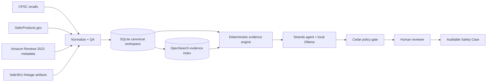

# SafeSKU

## Evidence-grounded product safety intelligence for online marketplaces

SafeSKU turns public product-safety artifacts into an investigation system.
It combines official CPSC recalls, SaferProducts.gov consumer incident reports,
Amazon marketplace metadata, and SafeSKU identity-linkage evidence to help an
investigator answer four questions:

1. What was officially recalled?
2. Which marketplace products could be the affected item?
3. Is there public safety evidence that predates the recall?
4. What can be concluded safely, and what still requires human review?

**Core principle: Evidence first. AI second.**

SafeSKU does not ask an LLM to invent product identity, recall facts, or temporal
relationships. Deterministic retrieval and evidence logic produce the facts first.
A bounded agent explains those facts, while Cedar policy controls which actions an
agent or human reviewer may take.

## Build It architecture



## Build It local stack

- AWS SAM CLI for local API Gateway and Lambda emulation
- SQLite for the canonical local workspace
- OpenSearch for evidence retrieval
- Strands Agents SDK for tool-using investigation
- Ollama for local inference
- Cedar for authorization and separation of duties
- FastAPI + Python backend
- Browser UI with a focused investigator/review workflow

AWS SAM supports running Lambda and API Gateway locally through Docker, which is
why the application can be demonstrated without deploying to AWS. citeturn881224search1

## Validated workspace

The current judge bundle produces:

| Artifact | Count |
|---|---:|
| CPSC recalls | 1,005 |
| SaferProducts incidents | 13,696 |
| Amazon marketplace products | 53,632 |
| Supplied linkage candidates | 84,037 |
| OpenSearch identity-candidate docs | 85,537 |
| OpenSearch documents total | 153,870 |

The extra 1,500 identity-candidate documents are fallback candidates generated by
the local investigation preparation path for recall cases without supplied
linkage rows. This is intentional and should be described in demos as generated
fallback candidates, not as additional source records.

## Quick start

Prerequisites: Docker, AWS SAM CLI, Python 3.12+ in the project environment,
Ollama, the local model, and Cedar CLI.

Start infrastructure:

```powershell
docker compose -f infra\build-it\docker-compose.yml up -d
```

Start SafeSKU locally:

```powershell
sam build --no-cached --template-file infra\build-it\template.yaml
sam local start-api --template .aws-sam\build\template.yaml --warm-containers eager --no-watch
```

Open `http://127.0.0.1:3000`.

The recommended demo bundle is:

```text
data\bundles\safesku-judge-bundle.zip
```

See `docs/USER_MANUAL.md` for the complete runbook.

## Golden demo case

Use **CPSC #22754**, the Mohnark Pharmaceuticals Lidocaine 4% topical anesthetic
cream recall, as the primary recorded demo case.

The intended demo is:

```text
Search recall
  -> official recall evidence
  -> marketplace identity candidates
  -> public safety reports
  -> temporal evidence
  -> agent trace
  -> Cedar policy decision
  -> human review
  -> Safety Case export
```

## Research framing

The research contribution is not simply "classify unsafe products". SafeSKU studies
cross-source product identity resolution and temporal evidence fusion across
official recalls, public consumer reports, and marketplace metadata, with an
explicit provenance graph and leakage-safe historical evaluation.

See `docs/RESULTS.md` and `docs/RESEARCH_EVALUATION.md`.

## Repository hygiene

Large raw datasets, local runtime databases, virtual environments, SAM build
artifacts, benchmark outputs, and generated bundle files are intentionally excluded
from Git. The repository contains the code, reproducibility instructions, compact
demo artifacts, evaluation summaries, and documentation needed to understand and
run the project.
