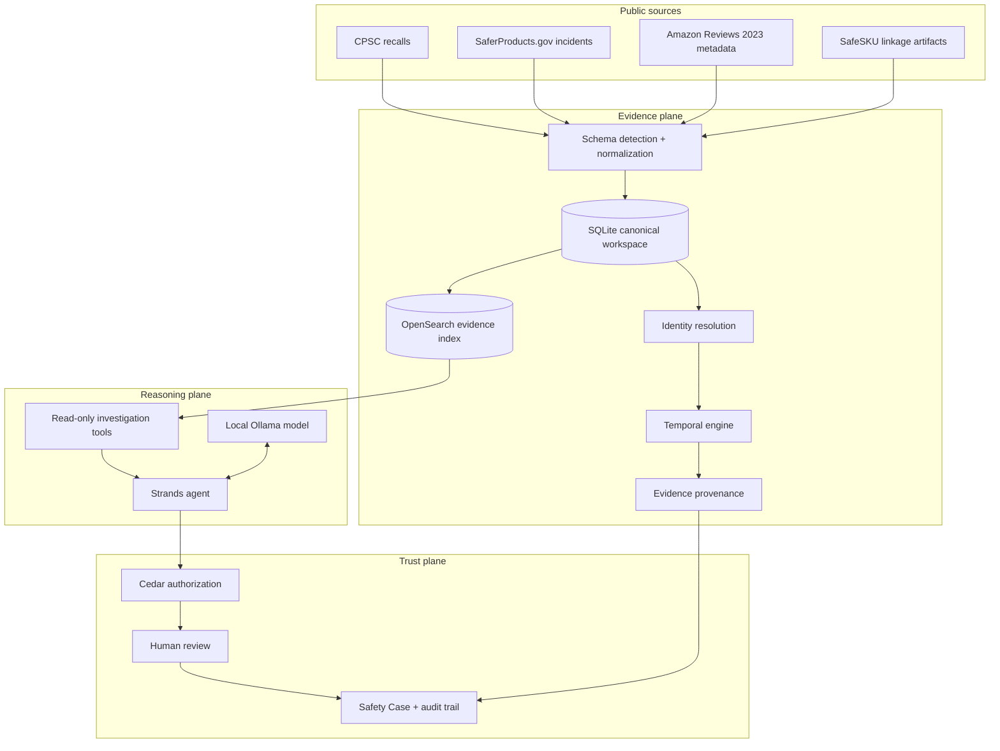
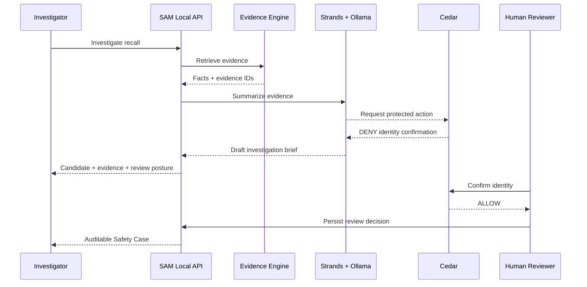

# SafeSKU Architecture

## Design goals

SafeSKU is designed around five properties:

1. **Evidence-grounded**: source records remain the authority.
2. **Temporal correctness**: a signal is pre-recall only when both incident date and
   publication date precede the recall date.
3. **Identity uncertainty is explicit**: candidates are not silently promoted to
   confirmed marketplace SKUs.
4. **Agent actions are bounded**: the model reads evidence and explains it, but it
   does not own the final identity decision.
5. **Reproducible locally**: the Build It submission can run without an AWS account.

## Logical architecture



## Trust boundary



## Canonical data model

```text
Recall
  ├── official facts
  ├── hazards
  └── recall date

SafetyIncident
  ├── incident date
  ├── publication date
  ├── product identity fields
  └── public narrative

MarketplaceProduct
  ├── parent ASIN
  ├── title
  ├── brand
  ├── model
  └── identifiers

IdentityCandidate
  ├── recall number
  ├── ASIN
  ├── linkage features
  ├── evidence score
  └── review status

EvidenceRecord
  ├── evidence ID
  ├── source
  ├── source record ID
  ├── kind
  └── event date

SafetyCase
  ├── recall
  ├── candidates
  ├── temporal findings
  ├── evidence IDs
  ├── authorization decisions
  └── human review
```

## Why SQLite + OpenSearch

SQLite remains the canonical local source of truth because the workspace is local,
portable, transactional, and easy to reproduce. OpenSearch is a retrieval/index
layer, not the authoritative store. This keeps the system simple while still
making the Build It search stack a real part of the application.

## Why the agent does not write identity decisions

Identity resolution has real uncertainty. The agent can gather and explain evidence,
but a high-level claim such as "this ASIN is the recalled product" must remain a
reviewable action. Cedar provides an explicit policy boundary between investigation
and approval.
