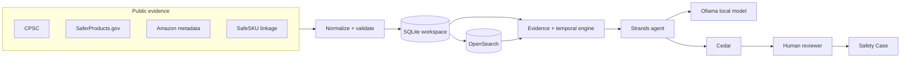
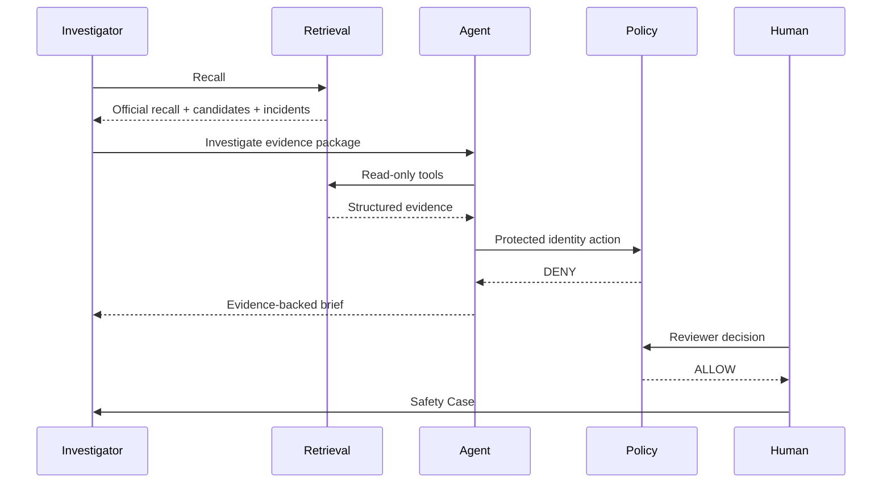
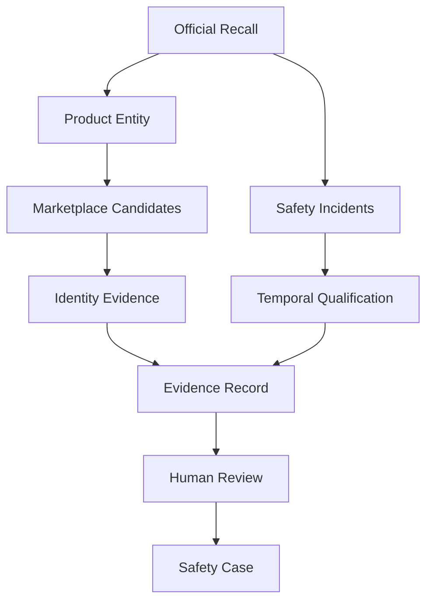
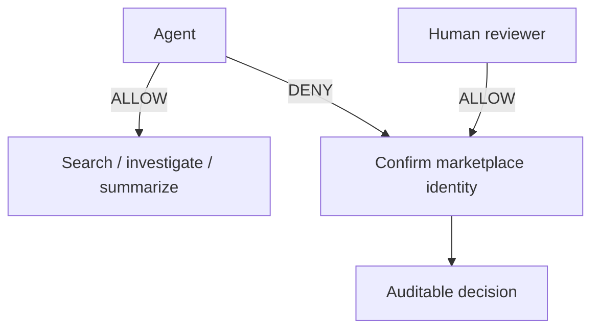

# SafeSKU Diagram Set

These Mermaid diagrams are the source-of-truth diagrams for the repository and the
submission deck/video.

## 1. End-to-end architecture

## 2. Investigation sequence

## 3. Evidence graph

## 4. Trust boundary

